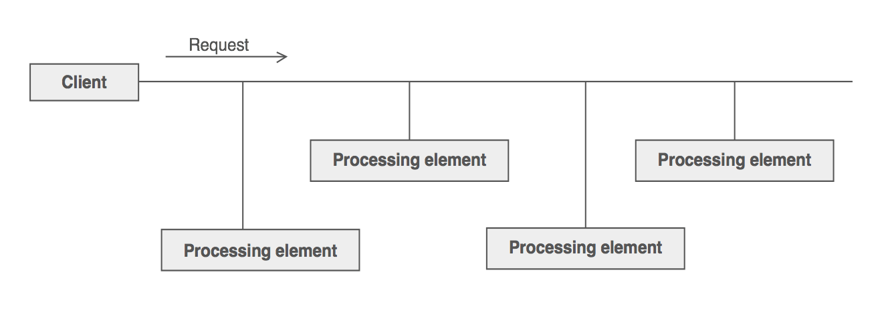

# Chain of responsibility

### Definition 

**Chain of Responsibility** is a behavioral design pattern that lets you avoid coupling the sender of a request to its receiver by giving more than one object a chance to handle the request. Chain the receiving objects and pass the request along the chain until an object handles it.

+ Avoid coupling the sender of a request to its receiver by giving more than one object a chance to handle the request. Chain the receiving objects and pass the request along the chain until an object handles it.
+ Launch-and-leave requests with a single processing pipeline that contains many possible handlers.
+ An object-oriented linked list with recursive traversal.
### Problem / Motivation
   There is a potentially variable number of "handler" or "processing element" or "node" objects, and a stream of requests that must be handled. Need to efficiently process the requests without hard-wiring handler relationships and precedence, or request-to-handler mappings.
   
   

   
### Usage / Applicability
When a program has several handlers capable of processing different requests, but you do not know in advance what type of request to expect.
+ You link several handlers into one chain. Request travels through the chain until it lands on a handler that can process it.
    
When it is important to execute handlers in a certain order.
+ Chain of Responsibility allows executing handlers one by one in a given order.

When a set of objects handling requests and their order should change dynamically.
+  Chain of Responsibility allows altering references withing an existing chain to insert, remove or reorder some handlers. 

### What problems can the Chain of Responsibility design pattern solve?
+ Coupling the sender of a request to its receiver should be avoided.
+ It should be possible that more than one receiver can handle a request.

Implementing a request directly within the class that sends the request is inflexible because it couples the class to a particular receiver and makes it impossible to support multiple receivers.

### What solution does the Chain of Responsibility design pattern describe?
+ Define a chain of receiver objects having the responsibility, depending on run-time conditions, to either handle a request or forward it to the next receiver on the chain (if any).

This enables to send a request to a chain of receivers without having to know which one handles the request. The request gets passed along the chain until a receiver handles the request. The sender of a request is no longer coupled to a particular receiver.

### Real life example

**Technical support**

You have just bought a new video card for your PC. Windows has detected and enabled it automatically. But your beloved Linux, however, refused to work with the new hardware. With a small glimpse of hope, you call the tech support.

The first thing you hear is a robot's voice of the autoresponder. It suggests nine popular solutions to various problems, none of which is related to yours. After a while, robot connects you to the live operator.

Alas, the operator can not suggest anything specific. It only shoots you with long excerpts from FAQ section. After hearing "did you try turning it off and on again" for the 10th time, you ask to connect you to a proper engineer.

The operator quickly passes your call to the engineer that inhabits a lonely server room in a basement of an office building. Finally, the engineer tells you where to download proper drivers for the card and how to install them in Linux. You end the call, bursting with joy.

  
### UML Diagram / Structures

   
   
### Sources 

  [RefactoringGuru](https://refactoring.guru/design-patterns/chain-of-responsibility)
  
  [Wikipedia](https://en.wikipedia.org/wiki/Chain-of-responsibility_pattern)
  
  [Soursemaking](https://sourcemaking.com/design_patterns/chain_of_responsibility)
  
  [Git](https://github.com/sohamkamani/javascript-design-patterns-for-humans#-chain-of-responsibility)
 
   
   
   
  