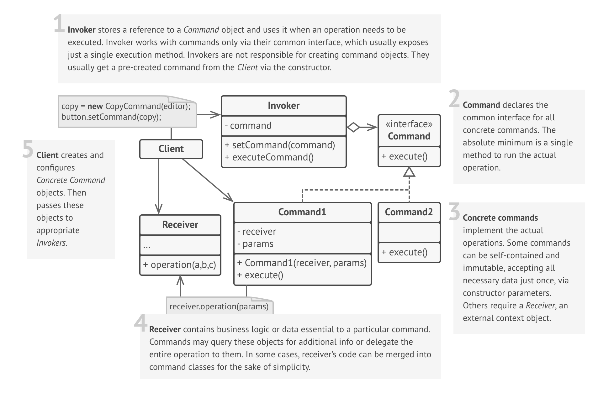

# Command

### Definition 
   Command is a behavioral design pattern that lets you turn a request into stand-alone object, which can be used to parametrize objects with different requests, queue or log requests, and support undoable operations.

   + Encapsulate a request as an object, thereby letting you parametrize clients with different requests, queue or log requests, and support undoable operations.
   + Promote "invocation of a method on an object" to full object status
   + An object-oriented callback

### Problem / Motivation
   
   
### Usage / Applicability

When you want to parameterize objects with actions. For example, when you develop a user interface component, such as a menu, you want your users to be able to configure menu items with actions that will be fired when a menu item is clicked.

+ The Command pattern turns operations into objects that can be linked from various UI elements. An element delegates the work to command objects instead of doing it by itself. A command executes an operation on its own or passes the call to the appropriate object of business logic.

When you want to queue, schedule, or execute operations remotely.

+ Like any other object, a command can be serialized, which means converting it to a string. That string can be saved to a file or database and retrieved later to be restored as a command object. But here is more! You could send a serialized command over the network, restore and executed it on a remote server.
  
When you need to be able to undo operations.

+ The first thing that you need to be able to revert operations is storing history. Although there are many ways to do this, the Command pattern is perhaps the most popular of all.
    
### Real life example
  Ordering at a restaurant
  
  You enter a restaurant and pick a window seat. A waiter takes your order on a piece of paper, brings to the kitchen and stick it to the wall, under all other orders.
  
  As you probably guessed, the paper ticket serves as a command. It remains in a queue until a chef is ready to serve it. The order contains all relevant information required to cook a dish. It allows a chef to start cooking right away instead of running around clarifying the order details.
### UML Diagram / Structures

   
   
### Sources 

  [RefactoringGuru](https://refactoring.guru/design-patterns/command)
  
  [Git](https://github.com/sohamkamani/javascript-design-patterns-for-humans#-command)
 
   
   
   
  