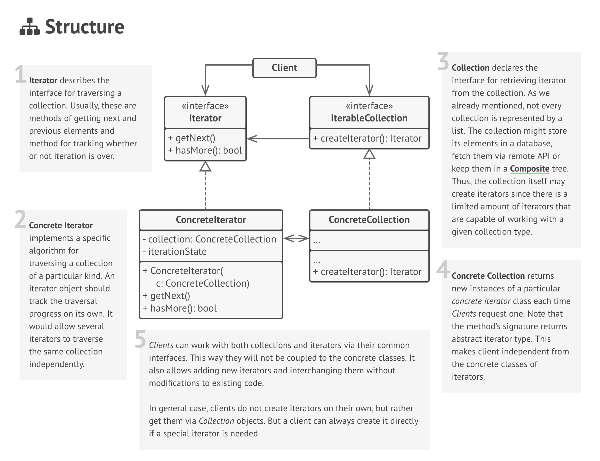

# Iterator

### Definition 
Iterator is a behavioral design pattern that lets you access the elements of an aggregate object sequentially without exposing its underlying representation.

   + Provide a way to access the elements of an aggregate object sequentially without exposing its underlying representation.
   + The C++ and Java standard library abstraction that makes it possible to decouple collection classes and algorithms.
   + Promote to "full object status" the traversal of a collection.
   + Polymorphic traversal
   

### Problem / Motivation
   
   Need to "abstract" the traversal of wildly different data structures so that algorithms can be defined that are capable of interfacing with each transparently.
   
### Usage / Applicability
When you have a complex data structure, and you want to hide its complexity from clients (either for convenience or security).
+ Iterator encapsulates interactions with a complex data structure and protects it from both careless and malicious actions. The Iterator pattern allows clients to work with collection items without exposing a collection object.
  
When you need to have several ways of traversing the same data structure but can not or will not add it to the collection or the code related to business logic.    
+  Non-trivial algorithms of traveling through data structures can be very bulky. When placed in the collection or the main business logic code, they blur the responsibility of the original code and make it less maintainable. Keeping this code inside iterators helps to make the application's code lean and clean.
  
When you want to have a single interface for traversing different data structures.

+ The Iterator provides a common interface for all implementations, which allows interchanging different iterators in client code.

### Real life example
  Tour guide
  
  Say, you plan to visit Rome for a week and go over all of its sightseeing. But once there, you can walk in circles for a long time, trying to find the Colosseum.
  
  On the other hand, you can spare some of the trip's budget and hire a local guide that knows the city like the back of his hand. The guide would be able to show you every attraction and tell a lot of interesting stories.
  
  But your budget is tight, so there is another option. You can use a virtual guide on your phone. It is not that fun, put cheap. And you could be staying at some interesting places as long as you want.
  
  Both the real human guide and the virtual guide on your phone act as iterators over the collection of sightseeings that Rome provides.
### UML Diagram / Structures

   
   
### Sources 

  [RefactoringGuru](https://refactoring.guru/design-patterns/iterator)
  
  [GitHub_#1](https://github.com/sohamkamani/javascript-design-patterns-for-humans#-iterator)
 
   
   
   
  