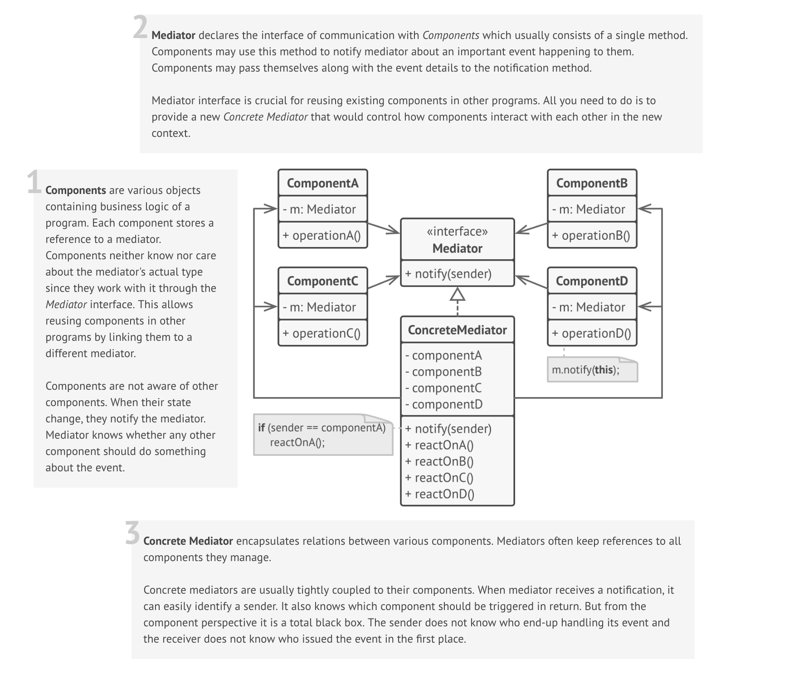

# Mediator

### Definition 
   Mediator is a behavioral design pattern that lets you define an object that encapsulates relations between a set of objects to make them independent of each other.
   
+ Define an object that encapsulates how a set of objects interact. Mediator promotes loose coupling by keeping objects from referring to each other explicitly, and it lets you vary their interaction independently.

+ Design an intermediary to decouple many peers.

+ Promote the many-to-many relationships between interacting peers to "full object status".
   

### Problem / Motivation
   
   We want to design reusable components, but dependencies between the potentially reusable pieces demonstrates the "spaghetti code" phenomenon (trying to scoop a single serving results in an "all or nothing clump").
   

### Usage / Applicability
 When chaotic dependencies between components turn a simple change in one component into a series of changes in all components.

+ Mediator extracts relations between classes into a separate class making changes to one component isolated from the rest of the code.
    
 When you can not reuse a component in a different program because it is too dependent on the other components.

+ After applying mediator, individual components become unaware of the other components. They communicate indirectly through a mediator object. Reusing a component in a different app requires creating a new mediator class.

 When you have to create tons of component subclasses just to use the same components in different contexts.

+ Mediator encapsulates relations between components. Therefore, it is enough to create a new mediator subclass to define a new set of relations between the same components.
### Real life example

**Air traffic control**

The control tower at a controlled airport demonstrates the Mediator pattern very well. The pilots of the planes approaching or departing the terminal area communicate with the tower rather than explicitly communicating with each other. The constraints on who can take off or land are enforced by the tower.

It is important to note that the tower does not control the whole flight. It exists only to enforce constraints in the terminal area.
  
### UML Diagram / Structures

   
   
### Sources 

  [RefactoringGuru](https://refactoring.guru/design-patterns/mediator)
  
  [Soursemaking](https://sourcemaking.com/design_patterns/mediator)
  
  [DoFactory](https://www.dofactory.com/javascript/mediator-design-pattern)
 
   
   
   
  