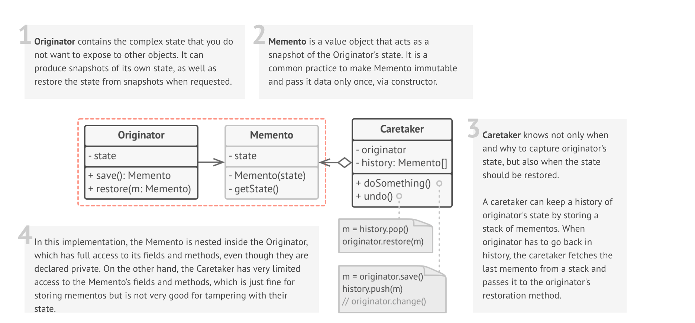

# Memento

### Definition 
   Memento is a behavioral design pattern that lets you capture the object's internal state without exposing its internal structure, so that the object can be returned to this state later.
   
+ Without violating encapsulation, capture and externalize an object's internal state so that the object can be returned to this state later.
+ A magic cookie that encapsulates a "check point" capability.
+ Promote undo or rollback to full object status.
   
### Problem / Motivation
   
The Memento design pattern defines three distinct roles:

+ Originator - the object that knows how to save itself.
+ Caretaker - the object that knows why and when the Originator needs to save and restore itself.
+ Memento - the lock box that is written and read by the Originator, and shepherded by the Caretaker.

   
### Usage / Applicability
 When you need to make snapshots of some objects in order to restore their state later.
 
+ The Memento pattern allows producing full copies of an object's state and storing them separately from the object. While the "undo" application of the pattern has become quite common, it also indispensable when dealing with transactions (if you need to roll-back an operation on error).

When direct access to the object fields/getters/setters violates its encapsulation.
+ The Memento makes the object itself responsible for creating a snapshot of its state. No other object is able to read the snapshot, making the object's state safe and secure.
 
### UML Diagram / Structures

   
   
### Sources 

  [RefactoringGuru](https://refactoring.guru/design-patterns/memento)
  
  [Soursemaking](https://sourcemaking.com/design_patterns/memento)
  
  [Git](https://github.com/sohamkamani/javascript-design-patterns-for-humans#-memento)
 
   
   
   
  