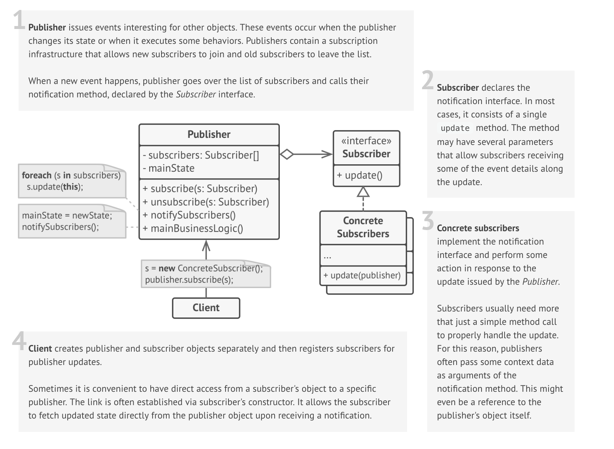

# Observer

### Definition 
   Observer is a behavioral design pattern that lets you define a one-to-many dependency between objects so that when one object changes state, all its dependents are notified and updated automatically.
   

### Problem / Motivation
   Imagine that you have two objects, a Customer and a Store. The store is about to receive a large shipment of a new product, which is very interesting to some customers.
   
   While customers could visit the store every day to check the availability of product, most of these trips would be pointless while the product is still on the way.
   
   On the other hands, the store could send tons of emails (spam) to all customers each time it receives a new shipment. But this would upset other customers, that do not care about the new product.
   
   Thus, we have a conflict: either customer wastes resources on periodic checks or the store itself wastes resources notifying wrong customers.
   
### Usage / Applicability

 When changes to the state of one object may require changing other objects, but the are unknown beforehand or change dynamically.

Defines a dependency between objects so that whenever an object changes its state, all its dependents are notified. 

For example, you are developing a GUI framework focused on buttons. You want your clients to be able to hook some custom code to your buttons so that it will fire whenever users press the button.
+ The Observer pattern allows any object that implements the subscriber interface to subscribe for the event notifications in publisher objects.

 Some objects should observe the others, but only for a limited time or in specific cases.
+ The Observer pattern lets publishers maintain dynamic lists of subscribers. All subscribers can join and leave the list whenever they want at runtime.
 
### Real life example

Magazine subscription

Once subscribed to a newspaper or magazine, you no longer need to go to the store and check if a next issue is available. Instead, the publisher will send new issues directly to your mailbox right after the publication.

The publisher maintains a list of subscribers and knows which magazines they are interested in. Subscribers can leave the list at any time when they wish to stop publisher sending new magazine issues to them.
  
### UML Diagram / Structures

   
   
### Sources 

  [RefactoringGuru](https://refactoring.guru/design-patterns/observer)
  
  [Soursemaking](https://sourcemaking.com/design_patterns/observer)
  
  [Git](https://github.com/sohamkamani/javascript-design-patterns-for-humans#-observer)
 
   
   
   
  