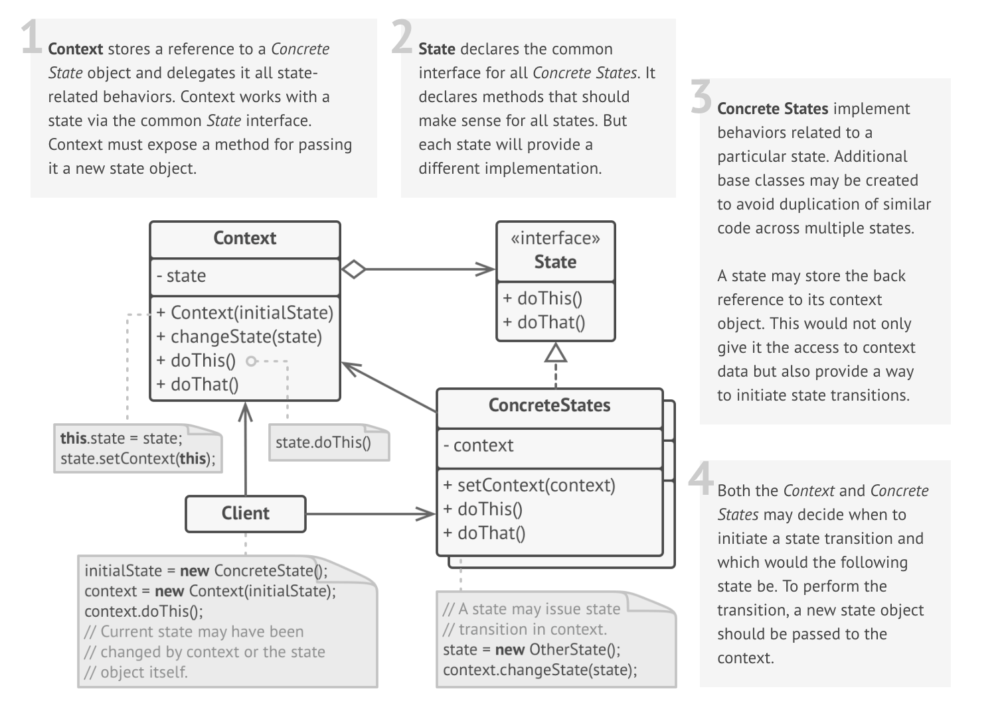

# State

### Definition 
   State is a behavioral design pattern that allows an object to alter its behavior when its internal state changes. The object will appear to change its class.
   
### Problem / Motivation
   Its main idea is that a program can be in one of the several states, which follow each other. The number of states and possible transitions between them is predefined and finite. Depending on the current state, the program behaves differently in response to the same events.
   
   The State pattern suggests to create new classes for all possible states of a context object and to extract the state-related behaviors into these classes.
### Usage / Applicability

When you have an object that behaves differently depending on its current state. The number of states is big. The state-related code changes frequently.

+ The State pattern suggests isolating the code, related to a state inside a separate class. The original class called "context" should have a reference to one of such state objects. It would delegate the work to a linked state object. Such structure allows changing the context's behavior by supplying it with a different state object.

 When a class is polluted with massive conditionals that alter method's behavior according to the current values of the class's fields.

+ The State pattern turns branches of the conditionals into methods within corresponding state classes. Then it relies on polymorphism to delegate the execution of the behavior to a linked state object.
 
When you have a lot of duplicate code across similar states and transitions of the conditional-based state machine.

+ The State pattern allows you to compose hierarchies of state classes and reduce duplication by moving common code into the base classes of the hierarchy.

### Real life example
**Smartphone**

The controls of your smartphone behave differently depending on the current state of the device:

When the phone is unlocked, pressing buttons execute various functions.
When the phone is locked, all buttons lead to the unlock screen.
When the phone's charge is low, all buttons show the charging screen.
  
### UML Diagram / Structures

   
   
### Sources 

  [RefactoringGuru](https://refactoring.guru/design-patterns/state) 
  
  [Git](https://github.com/sohamkamani/javascript-design-patterns-for-humans#-state)
 
   
   
   
  