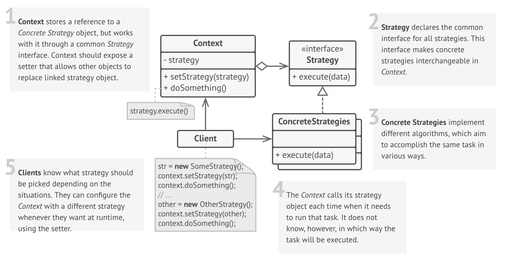

# Strategy

### Definition 
   
 Strategy is a behavioral design pattern that lets you define a family of algorithms, encapsulate each one, and make them interchangeable. Strategy lets the algorithm vary independently from the clients that use it.

### Problem / Motivation
   The Strategy pattern suggests to take a class that does something important in a lot of different ways and extract all these algorithms into separate classes called strategies.
   
   The original class, called context, will receive a field for storing a reference to one of the strategies. The context will delegate the work to a linked strategy instead of executing it on its own.
   
   The context will not be responsible for picking the appropriate algorithm for the job. Instead, the client will pass a desired strategy to the context.
   
   In fact, the context will not know much about strategies at all. It will communicate with all strategies through a basic interface, which will only expose the method for triggering an algorithm. This will make the context independent from strategies, allowing you to add new algorithms or modify existing without changing the code of the context or other strategies.
   
### Usage / Applicability
   When you have an object that should be able to do the same task in lots of different ways.
   
   + The Strategy pattern allows you to alter the object's behavior at runtime by supplying it with different sub-objects that actually perform the work.
  
   When you have lots of similar classes, that differ with in the way the execute some behavior.
   
   + The Strategy pattern allows you to combine all these classes into one by extracting all variants of the behavior into a separate class hierarchy, making the behavior of original class customizable.
   
   When you do not want to expose algorithm's implementation details to other classes.
   + The Strategy pattern isolates code, internal data, and dependencies of algorithms from other objects by extracting them into their own classes.
    
   An algorithm to be executed is selected by a monstrous conditional operator. Each branch of the conditional represents different algorithm.
   
   +  Strategy lets you decompose the conditional by extracting each algorithm into their own classes, all of which implement a common interface. Context delegates execution to one of these objects, instead of implementing the behavior by itself.
     

### Real life example

**Transport**

You have to get to the airport. You can catch a bus, order a cab, or get on your bicycle. The way of transportation is a strategy. You pick a strategy depending on the context, such as the budget or time constraints.
  
### UML Diagram / Structures

   
   
### Sources 

  [RefactoringGuru](https://refactoring.guru/design-patterns/strategy)
  
  [Git](https://github.com/sohamkamani/javascript-design-patterns-for-humans#-strategy)
 
   
   
   
  