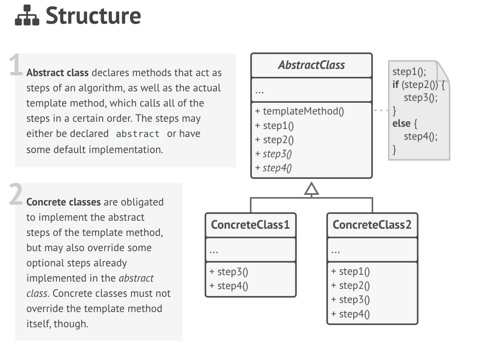

# Template method

### Definition 
   Template Method is a behavioral design pattern that lets you define the skeleton of an algorithm and allow subclasses to redefine certain steps of the algorithm without changing its structure.
   

### Problem / Motivation
   The Template Method pattern suggests to break down an algorithm into a series of steps, turn steps into methods and call them one by one inside a single "template" method.
   
   Subclasses will be able to override particular steps, but not the actual template method, leaving the algorithm structure unchanged.
   
   In our data mining app, we could create a common base class for all three parsing algorithms. The crucial part of the class would be a template method that looks as this:
   
### Usage / Applicability
When subclasses should be able to extend the base algorithm without altering its structure.

+ The Template Method turns a monolithic algorithm into a series of individual steps, which can be easily extended by subclasses, while keeping the structure, defined in a superclass, intact.
  
When you have several classes that do similar things with only minor differences. When you alter one of the classes, you have to change others as well.
    
+  The Template Method makes it easy to extract similar steps of the algorithm into a base class. Code that differs between subclasses can remain inside subclasses.

### Real life example
**Mass housing construction**

Builders use the analogy of template methods for mass housing construction. There is a standard template for building a house that describes the construction steps: laying a foundation, framing, building walls, plumbing and wiring for water and electricity, etc.

But despite the standardization, builders can slightly alter each step to make a house a little bit different (i.e. add more windows, paint walls in a different color, ...)

### UML Diagram / Structures

   
   
### Sources 

  [RefactoringGuru](https://refactoring.guru/design-patterns/template-method)
  
  [Git](https://github.com/kamranahmedse/design-patterns-for-humans#-template-method)
 
   
   
   
  