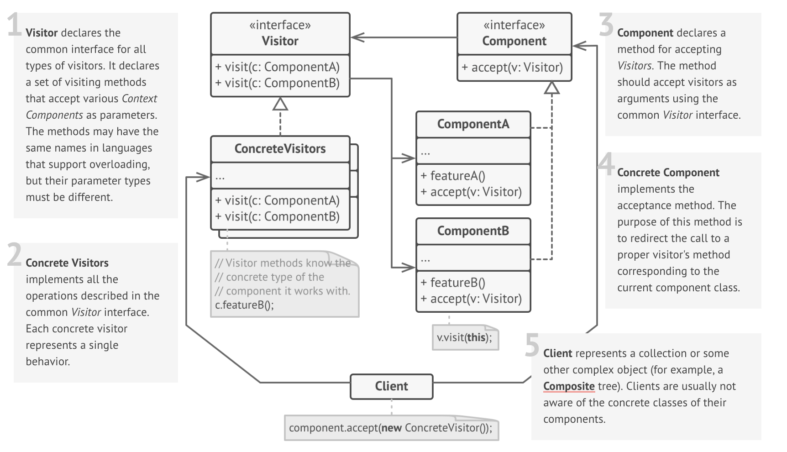

# Visitor

### Definition 
   Visitor is a behavioral design pattern that lets you define a new operation without changing the classes of the objects on which it operates.
   

### Problem / Motivation
   The Visitor pattern suggests placing a new behavior into a separate class, instead of integrating it into existing classes. Objects related to the behavior, will not be calling it by themselves. They will be passed as arguments to methods of the visitor object instead.
   
   The behavior's code may be a bit different for different types of objects. Hence, the visitor class must have a set of behavioral methods with different parameter types:
   

### Usage / Applicability
When you need to perform an operation on all elements of a complex object structure (for example, a tree), and all the elements are heterogeneous.
+  The Visitor pattern allows you to execute an operation over a set of objects with different classes.
  
When you need to be able to run several unrelated behaviors over a complex object structure, but you do not want to "clog" the structure's classes with the code of these behaviors.

+ The Visitor pattern allows you to extract and unify related behaviors from a bunch of classes that make an object structure, into a single visitor class. Such transformation will allow reusing these classes in various apps without carrying over nonrelevant behaviors

    
### Real life example

**Insurance agent**

Imagine a novice insurance agent, eager to get new customers. He randomly visits all the houses in the neighborhood, offering his services. But for each of the "types" of houses he visits, he has a special offer.

To a residence, he sells medical insurance.
To a bank, he sells theft insurance.
To a business, he sells fire and floods insurance.

  
### UML Diagram / Structures

   
   
### Sources 

  [RefactoringGuru](https://refactoring.guru/design-patterns/composite)
  
  [Git](https://github.com/sohamkamani/javascript-design-patterns-for-humans#-composite)
 
   
   
   
  