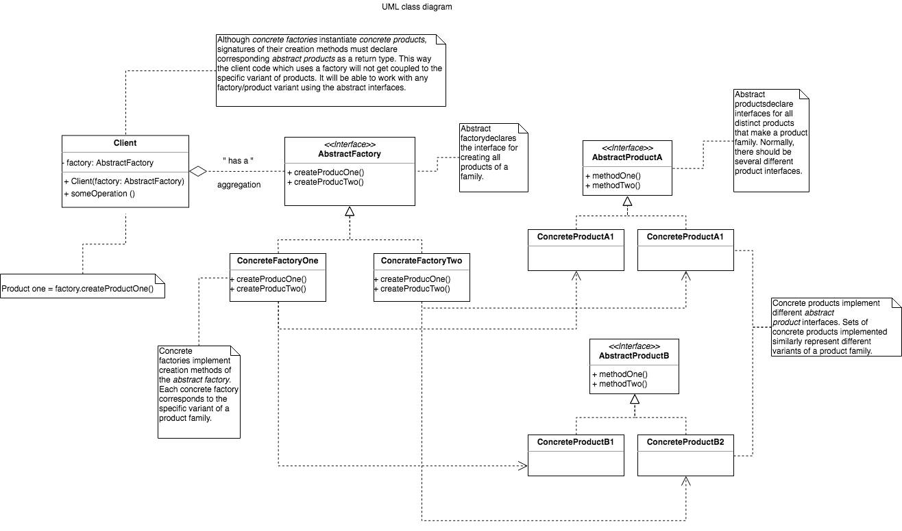

# Abstract Factory 

### Definition 

The essence of the Abstract Factory Pattern is to **"Provide an interface for creating families of related or dependent objects without specifying their concrete classes."**.

### Problem / Motivation

 + How can an application be independent of how its objects are created
 + How can a class be independent of how the objects it requires are created
 + How can families of related or dependent objects be created
  
### Usage 
 
 + The client code has no knowledge whatsoever of the concrete type, not needing to include any header files or class declarations related to it. The client code deals only with the abstract type. Objects of a concrete type are indeed created by the factory, but the client code accesses such objects only through their abstract interface
 + Adding new concrete types is done by modifying the client code to use a different factory, a modification that is typically one line in one file. The different factory then creates objects of a different concrete type, but still returns a pointer of the same abstract type as before — thus insulating the client code from change. 
   This is significantly easier than modifying the client code to instantiate a new type, which would require changing every location in the code where a new object is created (as well as making sure that all such code locations also have knowledge of the new concrete type, by including for instance a concrete class header file).
   If all factory objects are stored globally in a singleton object, and all client code goes through the singleton to access the proper factory for object creation, then changing factories is as easy as changing the singleton object.

### Solve next problems 
 + Encapsulate object creation in a separate (factory) object. That is, define an interface (AbstractFactory) for creating objects, and implement the interface.
 + A class delegates object creation to a factory object instead of creating objects directly.   
### Discussion
Provide a level of indirection that abstracts the creation of families of related or dependent objects without directly specifying their concrete classes. The "factory" object has the responsibility for providing creation services for the entire platform family. Clients never create platform objects directly, they ask the factory to do that for them.

This mechanism makes exchanging product families easy because the specific class of the factory object appears only once in the application - where it is instantiated. The application can wholesale replace the entire family of products simply by instantiating a different concrete instance of the abstract factory.

Because the service provided by the factory object is so pervasive, it is routinely implemented as a Singleton.

### Real life example 
The purpose of the Abstract Factory is to provide an interface for creating families of related objects, without specifying concrete classes. This pattern is found in the sheet metal stamping equipment used in the manufacture of Japanese automobiles. The stamping equipment is an Abstract Factory which creates auto body parts. 
The same machinery is used to stamp right hand doors, left hand doors, right front fenders, left front fenders, hoods, etc. for different models of cars. Through the use of rollers to change the stamping dies, the concrete classes produced by the machinery can be changed within three minutes.

### UML Diagram 

   

Sources 

  [Wikipedia](https://en.wikipedia.org/wiki/Abstract_factory_pattern)

  [Learning JavaScript Design Patterns a book ](https://addyosmani.com/resources/essentialjsdesignpatterns/book/#factorypatternjavascript)
  
  [Soursemaking](https://sourcemaking.com/design_patterns/abstract_factory)
  
  [RefactoringGuru](https://refactoring.guru/uk/design-patterns/abstract-factory)
 
   
   
  