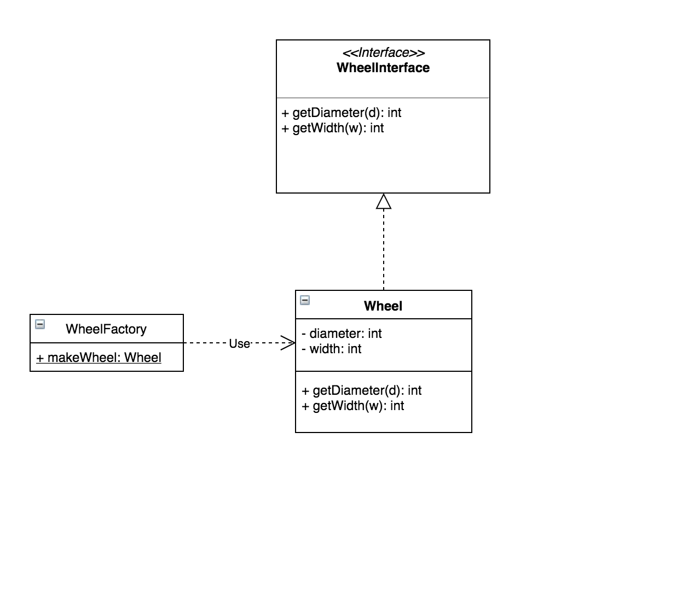

#Simple factory or Factory Pattern

###Defined

   + Simple factory generates an instance of an object/service for client
     without exposing any implementation or instantiation login to the client.
   + I  n OOP, a factory is an object for creating other objects.
   + In object-oriented programming (OOP), a factory is an object for creating other 
     objects – formally a **factory is a function or method that returns objects**
     of a varying prototype or class from some method call, which is assumed to be "new".

###Problem / Motivation
   + A constructor is concrete in that it creates objects as instances of a single class, and by a specified process (class instantiation), while a factory can create objects by instantiating various classes, or by using other allocation schemes such as an object pool.
   + In class-based programming, a factory is an abstraction of a constructor of a class, while in prototype-based programming a factory is an abstraction of a prototype object. 

###Usage 
   + Using factories provides encapsulation, and means the code is not tied to specific classes or objects, and thus the class hierarchy or prototypes can be changed or refactored without needing to change code that uses them – they abstract from the class hierarchy or prototypes.
   + Simple factory pattern can be used when creation of an object involves 
     some business logic beyond initialization. It helps in hiding such logic from it.
   + When creating an object is not just a few assignments and involves some logic, 
     it makes sense to put it in a dedicated factory instead of repeating the same code everywhere.
   + Difficult logic can be hied by instantiation. 

### UML Diagram 
   
  

Sources 
   + [Wikipedia](https://en.wikipedia.org/wiki/Factory_(object-oriented_programming)) 
   + [Medium article](https://medium.com/nestedif/java-simple-factory-pattern-9c2538dd0265)
   
   
  