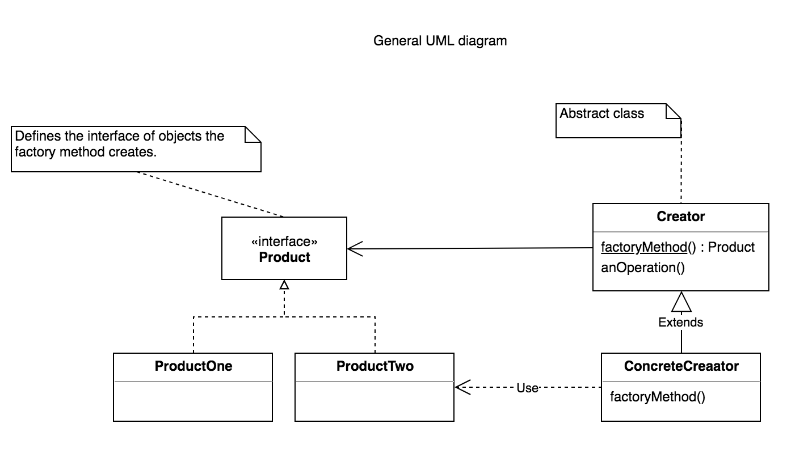

#Factory Method 

###Definition 

> "Define an interface for creating an object, but let subclasses decide which class to instantiate.
   The Factory method lets a class defer instantiation it uses to subclasses." 
   (Gang Of Four)

   Creating an object often requires complex processes not appropriate to include within a composing object. 
   The object's creation may lead to a significant duplication of code, may require information not accessible to the composing object, may not provide a sufficient level of abstraction, or may otherwise not be part of the composing object's concerns.
 
   The factory method design pattern handles these problems **by defining a separate method for creating the objects, which subclasses can then override to specify the derived type of product that will be created**.
   

   + It provides a way to delegate the instantiation logic to child classes.
   + The factory method pattern relies on inheritance, as object creation is delegated to subclasses that implement the factory method to create objects.
   + Defining a "virtual" constructor.
   + Factory Method is similar to Abstract Factory but without the emphasis on families.

###Problem / Motivation
  + Factory Method makes a design more customizable and only a little more complicated. Other design patterns require new classes, whereas Factory Method only requires a new operation.
  
###Usage 
   + When creating an object is not just a few assignments and involves some logic, it makes sense to put it in a dedicated factory instead of repeating the same code everywhere.
    
   + When our object or component setup involves a high level of complexity
   
   + When we need to easily generate different instances of objects depending on the environment we are in
   
   + When we're working with many small objects or components that share the same properties
   
   + When composing objects with instances of other objects that need only satisfy an API contract (aka, duck typing) to work. This is useful for decoupling.

### UML Diagram 

   

Sources 

  [Wikipedia](https://en.wikipedia.org/wiki/Factory_method_pattern#Example_implementations)
   
  [Learning JavaScript Design Patterns a book ](https://addyosmani.com/resources/essentialjsdesignpatterns/book/#factorypatternjavascript)
  
  [Soursemaking](https://sourcemaking.com/design_patterns/factory_method)
 
   
   
  