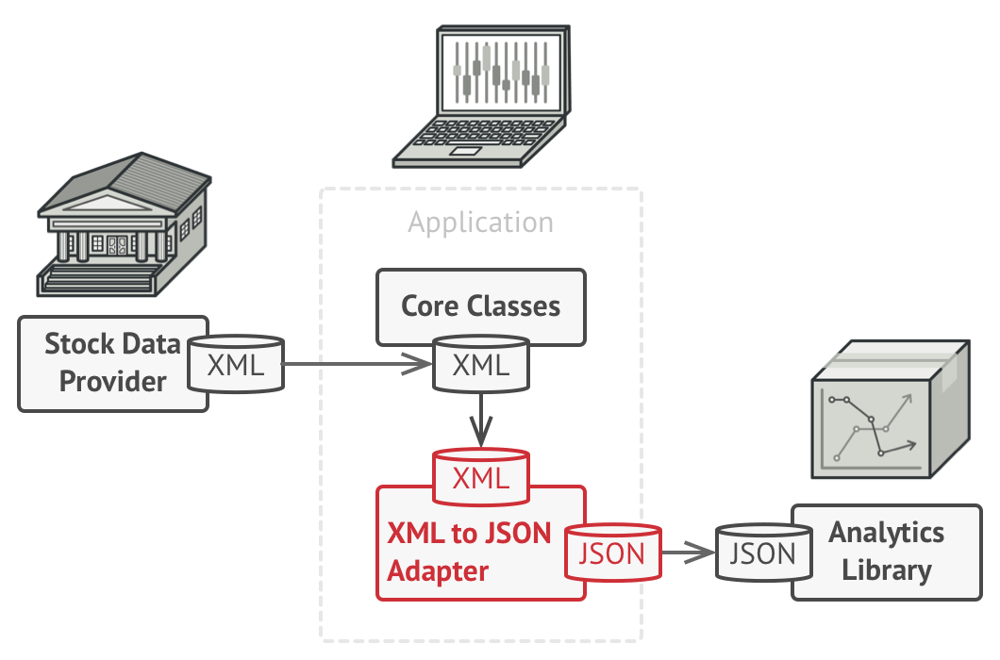

# Adapter

### Definition 
    
   + Convert the interface of a class into another interface clients expect. Adapter lets classes work together that couldn't otherwise because of incompatible interfaces.
   + Wrap an existing class with a new interface.
   + Allows the interface of an existing class to be used as another interface.
   + Impedance match an old component to a new system
   + It is often used to make existing classes work with others without modifying their source code.

### Problem / Motivation
   For example, your app works with a stock data. It downloads data from multiple data providers in XML and builds nicely looking charts. In a new version, you decided to improve the app and use some smart analytics library. But there is a catch: the analytics library only works with data in JSON format.
    
   In cases like this, you could either rewrite your code to support JSON or change the library itself to work with XML. The first choice may break your existing code, and the second might simply be impossible if the library's code is unavailable.
### Usage 

   + When you want to reuse existing class, but its interface is not compatible with the rest of application's code.
   + The Adapter pattern creates a middle layer class that translates application calls to the form that the existing class understands.
   + You need to reuse several existing classes, but they lack some common functionality. And you can not add it to the superclass because it is either closed or used in other code.
   + You could put the missing functionality into a new adapter class. It will connect your app's code and the classes you are interested in. This solution looks very similar to the Visitor pattern
 
### The adapter design pattern solves problems like:
    
   + How can a class be reused that does not have an interface that a client requires?
   + How can classes that have incompatible interfaces work together?
   + How can an alternative interface be provided for a class?
   + Often an (already existing) class can't be reused only because its interface doesn't conform to the interface clients require.
    
### The adapter design pattern describes how to solve such problems:

   + Define a separate adapter class that converts the (incompatible) interface of a class (adaptee) into another interface (target) clients require.
   + Work through an adapter to work with (reuse) classes that do not have the required interface.
   + The key idea in this pattern is to work through a separate adapter that adapts the interface of an (already existing) class without changing it.
   + Clients don't know whether they work with a target class directly or through an adapter with a class that does not have the target interface.

### Addons / Real life example
    
   Example one 
    
   
   
   
      
   Example two
   
   Power plugs and sockets in different countries
   When you fly from the US to Europe for the first time, you may get a surprise when you try to charge your laptop. The power plug & sockets standards vary between countries. That is why your US plug will not fit the German socket.
   
   The problem can be solved by a power plug adapter that has the American-style socket and the European-style plug.
   
   Example tree (see [AdapterImpemetationFile](./Adapter.js))
   
   

### UML Diagram / Structures

#### Object adapter

   This implementation uses composition principle: adapter implements the interface of one object and wraps the other one. It can be implemented in all major programming languages.
   
   
   
#### Class adapter   

   This implementation uses inheritance. Adapter inherits both interfaces at the same time. It can be implemented only in languages that support multiple inheritance, such as C++.
   
   

### Sources 

  [RefactoringGuru](https://refactoring.guru/design-patterns/adapter)
  
  [Wikipedia](https://en.wikipedia.org/wiki/Adapter_pattern)
  
  [Soursemaking](https://sourcemaking.com/design_patterns/adapter)
 
   
   
   
  