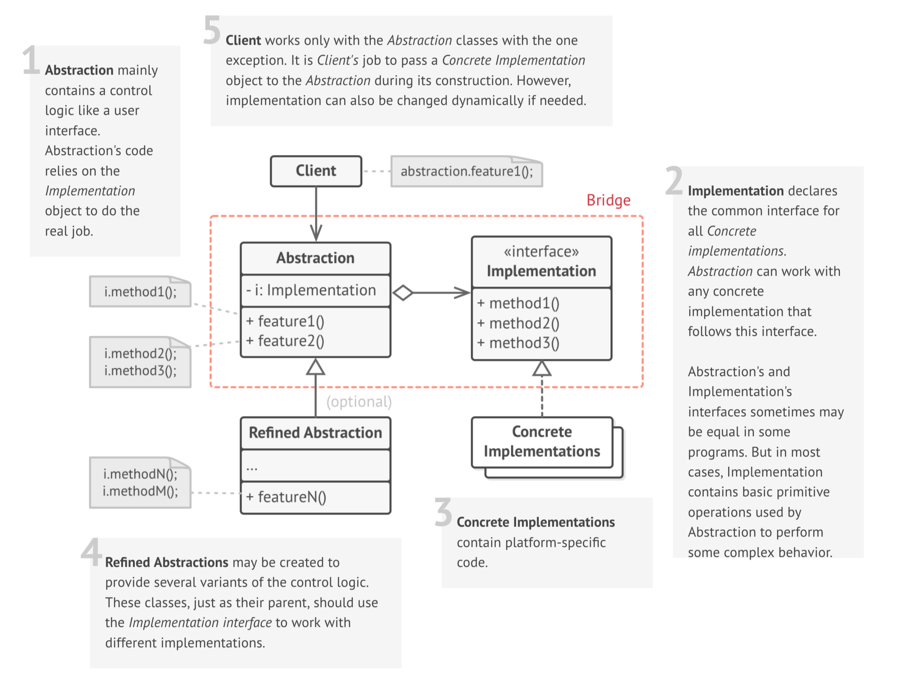

# Bridge

### Definition 
   
   Bridge is a structural design pattern that lets you split a giant class or a set of closely related classes into two separate hierarchies, 
   abstraction and implementation, which can be developed independently of each other.
   
   Thus, the Bridge pattern allows you to break an entity into several different ones and then evolve them independently from each other.

   + Decouple an abstraction from its implementation so that the two can vary independently.
   + Publish interface in an inheritance hierarchy, and bury implementation in its own inheritance hierarchy.
   + Beyond encapsulation, to insulation
  
### Problem / Motivation
   
   "Hardening of the software arteries" has occurred by using subclassing of an abstract base class to provide alternative implementations. This locks in compile-time binding between interface and implementation. The abstraction and implementation cannot be independently extended or composed.

### Usage 
   +  When you have a huge class that has several variants of some functionality (for example, works with different database servers). 
   The Bridge pattern splits the monolithic class into several class hierarchies, one of which references the other ones. Classes in these hierarchies can be edited independently from the other ones. It simplifies the support and minimizes a risk of breaking existing code.
   + When you need to extend a class in several orthogonal (independent) dimensions.
   Instead of growing a single hierarchy, Bridge pattern suggests to create a separate class hierarchy for each dimension and link these hierarchies with a reference field.
   + When you need to be able to change implementation at runtime.
   Although it is optional, Bridge pattern allows changing the implementation  

### The bridge design pattern solves problems like:
   + An abstraction and its implementation should be defined and extended independently from each other. 
   + A compile-time binding between an abstraction and its implementation should be avoided so that an implementation can be selected at run-time.
    
### The bridge design pattern describes how to solve such problems:

   + Separate an abstraction (Abstraction) from its implementation (Implementor) by putting them in separate class hierarchies.
   + Implement the Abstraction in terms of (by delegating to) an Implementor object.

This enables to configure an Abstraction with an Implementor object at run-time. 
See also the UML class and sequence diagram below.

### Real life example

   In this example Bridge breaks the monolithic code of the devices and remote controls into several parts:

   + Devices (act as implementation)
   + Remotes (act as abstraction)
 
   The Bridge pattern is especially useful when dealing with cross-platform apps, supporting multiple types of database servers or working with several API providers of a certain kind (for example, cloud platforms, social networks, etc.)

   Example tree (see [Bridge](./Example.png))
   
   The remote's base class has a field that contains a reference to a device object that it controls. Remotes work with devices through a common interface. It allows one remote to work with several device types.
   
   You can change remote control classes independently from the device classes. For instance, you could create a simple remote with only two buttons or sophisticated remote with a touch screen.
   
   Thus, the Bridge pattern allows you to break an entity into several different ones and then evolve them independently from each other. Client code also remains simple. It only needs to pick an abstraction and configure it with one of the implementations.
   

### UML Diagram / Structures

   
   
### Sources 

  [RefactoringGuru](https://refactoring.guru/design-patterns/bridge)
  
  [Wikipedia](https://en.wikipedia.org/wiki/Bridge_pattern)
  
  [Soursemaking](https://sourcemaking.com/design_patterns/bridge)
 
   
   
   
  