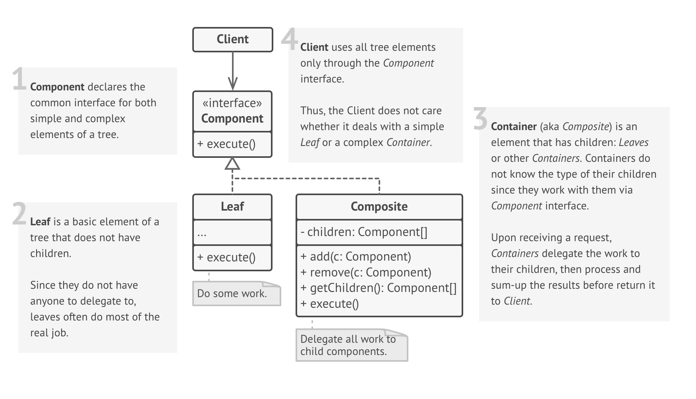

# Composite

### Definition 
   
   Composite is a structural design pattern that lets you compose objects into tree structures and allow clients to work with these structures as if they were individual objects.
   
   + Compose objects into tree structures to represent whole-part hierarchies. Composite lets clients treat individual objects and compositions of objects uniformly.
   + Recursive composition
   + "Directories contain entries, each of which could be a directory."
   + 1-to-many "has a" up the "is a" hierarchy

### Problem / Motivation
   
   Application needs to manipulate a hierarchical collection of "primitive" and "composite" objects. Processing of a primitive object is handled one way, and processing of a composite object is handled differently. Having to query the "type" of each object before attempting to process it is not desirable.

   The composite pattern makes sense only when your business model can be represented as a tree.
   For instance, you have two objects: Product and Box. The Box can contain several  Products and a number of smaller Boxes inside. These little Boxes can also hold inside some Products or even smaller Boxes and so on.
   Now, imagine that your Products and Boxes can be a part of order. How hard can it be to calculate the order total? You just take a large Box, unwrap it and see what is inside:  ProductA, ProductB, oh, another Box, let's see what inside... Before too long, you will end up in a pile of duct tape and cardboard still trying to sum-up the price.
   
   Isn't there a better way?
   

### Usage / Applicability

   When you have to implement a tree-like structure that has simple elements and containers.
   
   + The Composite pattern offers two basic elements: simple leaves and complex containers that store other leaves or containers, and so on. Pattern forces the containers to work with all child elements through the common interface, which allows running operations recursively over the whole tree structure.
   
   When Clients should treat simple and complex elements uniformly.
   
   + When Clients should treat simple and complex elements uniformly.

   
### The bridge design pattern solves problems like:
    
   + A part-whole hierarchy should be represented so that clients can treat part and whole objects uniformly.
   + A part-whole hierarchy should be represented as tree structure.
    
### The bridge design pattern describes how to solve such problems:
    
   + Define a unified Component interface for both part (Leaf) objects and whole (Composite) objects.
   
   + Individual Leaf objects implement the Component interface directly, and Composite objects forward requests to their child components.
  

### Real life example
   Military structure

   Armies of most countries look like composite trees. On the lowest level, there are soldiers. They are grouped into squads. Several squads make a platoon. Platoons make a division. And finally, several divisions make an army.

   Orders are given at the top of the hierarchy and passed down at each level until every soldier knows what needs to be done.

### UML Diagram / Structures

   
   
### Sources 

  [RefactoringGuru](https://refactoring.guru/design-patterns/composite)
  
  [Wikipedia](https://en.wikipedia.org/wiki/Composite_pattern)
  
  [Soursemaking](https://sourcemaking.com/design_patterns/composite)
  
  [Git](https://github.com/sohamkamani/javascript-design-patterns-for-humans#-composite)
 
   
   
   
  