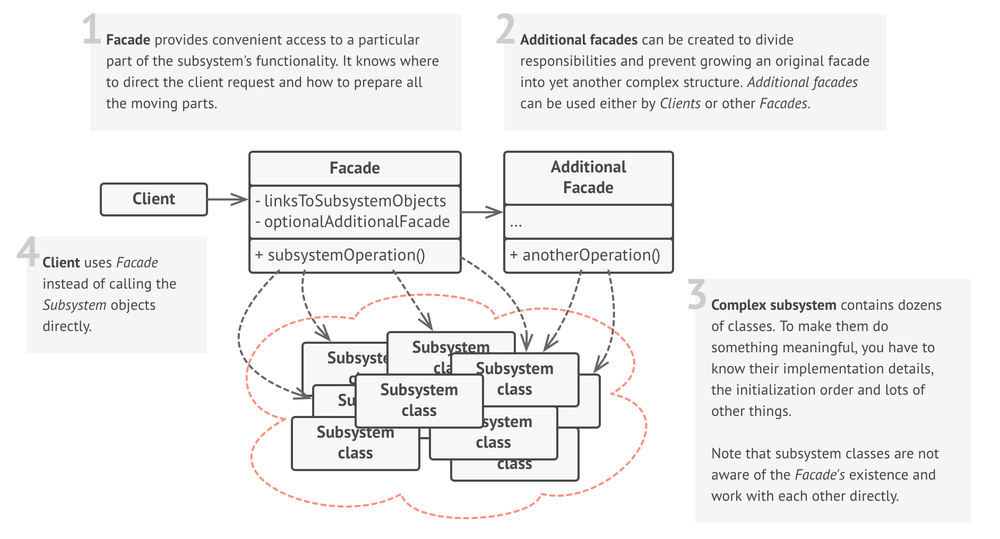

# Facade

### Definition 

+ Provide a unified interface to a set of interfaces in a subsystem. Facade defines a higher-level interface that makes the subsystem easier to use.
+ Wrap a complicated subsystem with a simpler interface.
+ Facade is a structural design pattern that lets you provide a simplified interface to a complex system of classes, library or framework.

### Problem / Motivation   

Imagine the code that has to work with a large set of objects of some complex library or framework. You have to manually initialize all these objects, keep track of the dependencies, correct order and so on.

In the end, the business logic of your classes becomes tightly coupled to the implementation details of third party library. Such code is pretty hard to comprehend and maintain.

### Usage / Applicability

+ When you need to have a simple but limited interface to a complex subsystem.

Often subsystems get more complex over time. Even applying design patterns often leads to creating more classes. The subsystem may become more flexible and easier to reuse in different contexts, but the amount of boilerplate code it requires also grows. The Facade attempts to fix it by providing access to a fraction of a subsystem that fits most client needs.

+ When you want to structure a subsystem into layers.

Create facades to define entry points to each level of a subsystem. If multiple subsystems depend on each other, you can limit the coupling by requiring subsystems to communicate only through facades.

### The bridge design pattern solves problems like:

+ To make a complex subsystem easier to use, a simple interface should be provided for a set of interfaces in the subsystem.
+ The dependencies on a subsystem should be minimized.

### The bridge design pattern describes how to solve such problems:

+ implements a simple interface in terms of (by delegating to) the interfaces in the subsystem and
+ may perform additional functionality before/after forwarding a request.
    
### Real life example

 + Placing orders by phone
 
   When you call a shop to place a phone order, an operator is your facade to all services and departments of the shop. He or she provides a simple interface to the ordering system, payments, and delivery services.
 + How do you turn on the computer? "Hit the power button" you say! That is what you believe because you are using a simple interface that computer provides on the outside, internally it has to do a lot of stuff to make it happen. This simple interface to the complex subsystem is a facade.
### UML Diagram / Structures

   
   
### Sources 

  [RefactoringGuru](https://refactoring.guru/design-patterns/facade)
  
  [Wikipedia](https://en.wikipedia.org/wiki/Facade_pattern)
  
  [Soursemaking](https://sourcemaking.com/design_patterns/facade)
  
  [Git](https://github.com/sohamkamani/javascript-design-patterns-for-humans#-decorator)
 