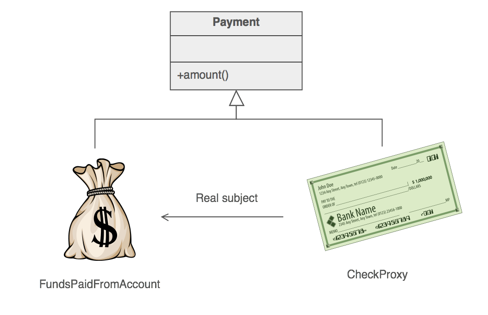
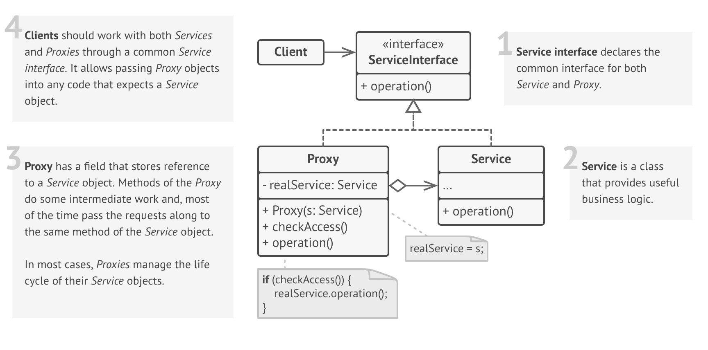

# Proxy

### Definition 
   
   Proxy is a structural design pattern that lets you provide a substitute or placeholder for another object to control access to it.
    
  + Provide a surrogate or placeholder for another object to control access to it.
  + Use an extra level of indirection to support distributed, controlled, or intelligent access.
  + Add a wrapper and delegation to protect the real component from undue complexity.

### Problem / Motivation
   Why would you control the access to an object? Here is an example: you have a powerful object that loves to consume vast amounts of system resources. You need it from time to time, but not always.
   
   Thus, the object could probably be created not at the program start, but rather when it is actually needed. Each client of this object would need to have some sort of deferred initialization code. Obviously, it leads to a lot of duplication.
   
   In an ideal world, we would put this code directly into the object's class, but that is not always possible. For instance, the class may reside in a closed 3rd-party library.
   
### Usage / Applicability

Lazy initialization (virtual proxy). When you have a heavyweight object that loads data from a filesystem, network or database.

+ Instead of loading data at the application start, one could delay the object's initialization to a time when it is needed.

Access control (protection proxy). When a program has different user types and you want to protect an object from the unauthorized usage. For instance, when objects are crucial parts of an operating system and programs (including malicious ones) are their clients.

+ Proxy can check the client's credentials on each request and pass the request to the service object only if the access is granted.

Local execution of a remote service (remote proxy). When a real service object is located on a remote server.
 
+ In this case proxy passes client request to a remote service object over the network, handling all the network transfer details.

Caching objects ("smart" reference). When you need to cache the results of client requests and manage their life cycle (when the results are heavyweight).

+ Proxy can count the number of reference to a service object or cached results. When all references released, the proxy can destroy the object it tracks (for instance, terminate the database connection).
  
+ Proxy can also track whether the client changed the service object. It allows reusing unchanged object and saves the system resources.
  
Request logging (logging proxy). When you need to keep a history of requests to a service object.

+ Proxy can log each request before passing it to a service object.

### What problems can the Proxy design pattern solve? 

+ The access to an object should be controlled .
+ Additional functionality should be provided when accessing an object.

When accessing sensitive objects, for example, it should be possible to check that clients have the needed access rights.

### What solution does the Proxy design pattern describe?

Define a separate Proxy object that

+ can be used as substitute for another object (Subject) and
+ implements additional functionality to control the access to this subject. 
    
### Real-World Analogy
    
  Check
  A check is a document that orders a bank to pay a specific amount of money from a person's account to the person in whose name the cheque has been issued. Both check and cash have a common interface: they can be used as payment. Thus, a check is a proxy for a bunch of cash.
  
  From a consumer standpoint, checks are great because there is no need to carry loads of cash around. For shop owners, they are also fine, since can be converted to cash at the nearest bank.

  
  
### UML Diagram / Structures

   
   
### Sources 

  [RefactoringGuru](https://refactoring.guru/design-patterns/proxy)
  
  [Wikipedia](https://en.wikipedia.org/wiki/Proxy_pattern)
  
  [Git](https://github.com/sohamkamani/javascript-design-patterns-for-humans#-proxy)
 
   
   
   
  